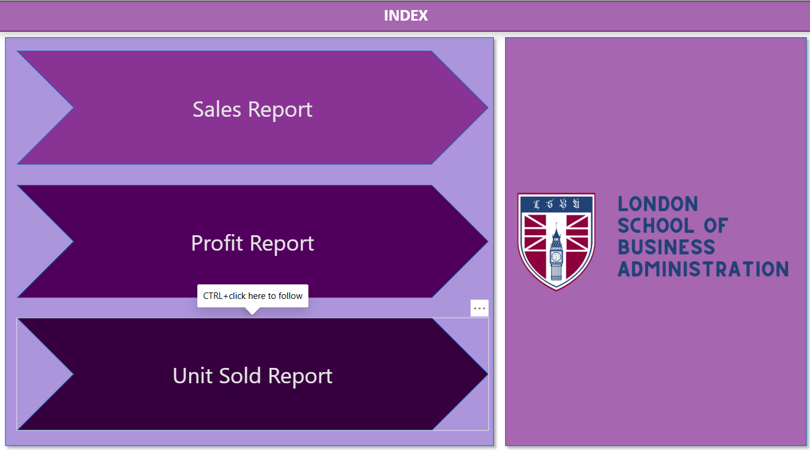
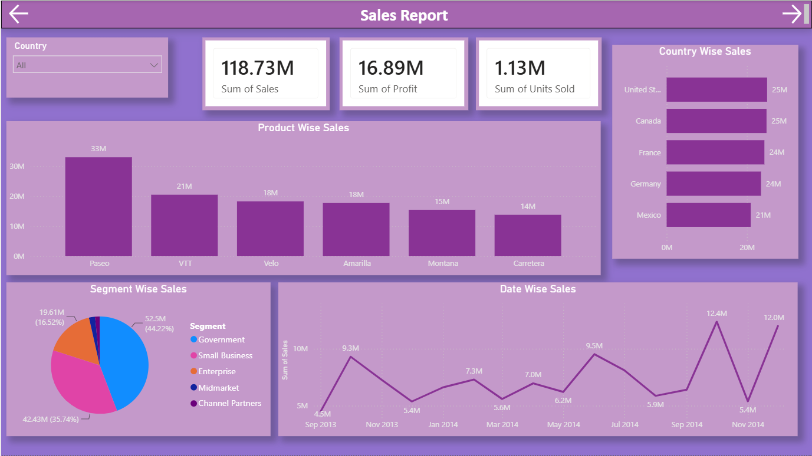
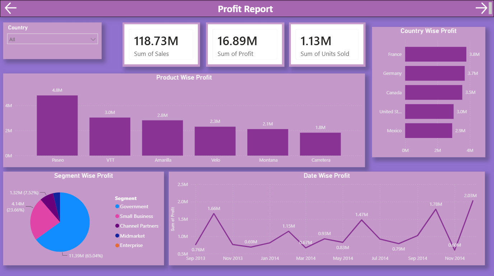
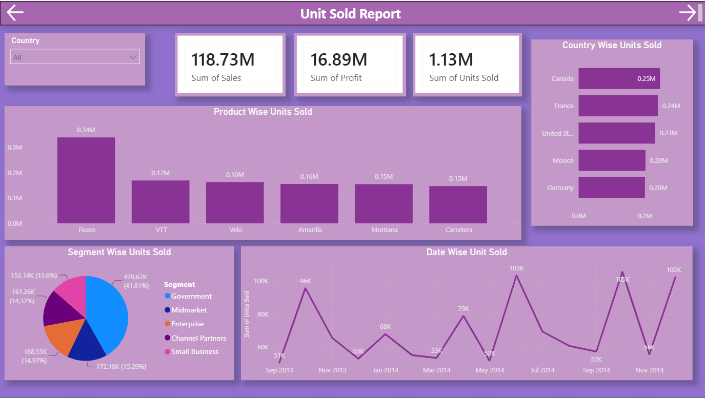

# Power BI Sales, Profit & Unit Sold Dashboard

## Overview

This project is an interactive Power BI dashboard for analyzing Sales, Profit, and Units Sold.

The dashboard includes an INDEX page for navigation between different reports and uses interactive visualizations, slicers, KPI cards, and filters to explore business performance.

## Dashboard Pages

### 1. INDEX

The INDEX page provides navigation to:

- Sales Report
- Profit Report
- Unit Sold Report

### 2. Sales Report

The Sales Report focuses on sales performance using:

- Total Sales
- Total Profit
- Total Units Sold
- Product analysis
- Segment analysis
- Country analysis
- Time-based sales trends
- Country slicer for filtering

### 3. Profit Report

The Profit Report focuses on profitability using:

- Total Sales
- Total Profit
- Total Units Sold
- Product analysis
- Segment analysis
- Country analysis
- Time-based profit trends
- Country slicer for filtering

### 4. Unit Sold Report

The Unit Sold Report focuses on sales volume using:

- Total Sales
- Total Profit
- Total Units Sold
- Product analysis
- Segment analysis
- Country analysis
- Time-based unit sold trends
- Country slicer for filtering

## Tools & Skills

- Microsoft Power BI
- DAX
- Data Visualization
- Data Analysis
- Interactive Dashboard Design
- Slicers and Filters
- Page Navigation
- Date Hierarchy
- Business Intelligence

  ## Dashboard Preview

### INDEX


### Sales Report


### Profit Report


### Unit Sold Report


### Slicers & Filters


## Project Structure

```text
powerbi-sales-profit-unit-dashboard/
├── README.md
├── LICENSE
│
├── PowerBI/
│   └── PowerBI_Dashboard_USP.pbix
│
└── Screenshots/
    ├── 01_Index.png
    ├── 02_Sales_Report.png
    ├── 03_Profit_Report.png
    ├── 04_Unit_Sold_Report.png
    └── 05_Slicers.png


